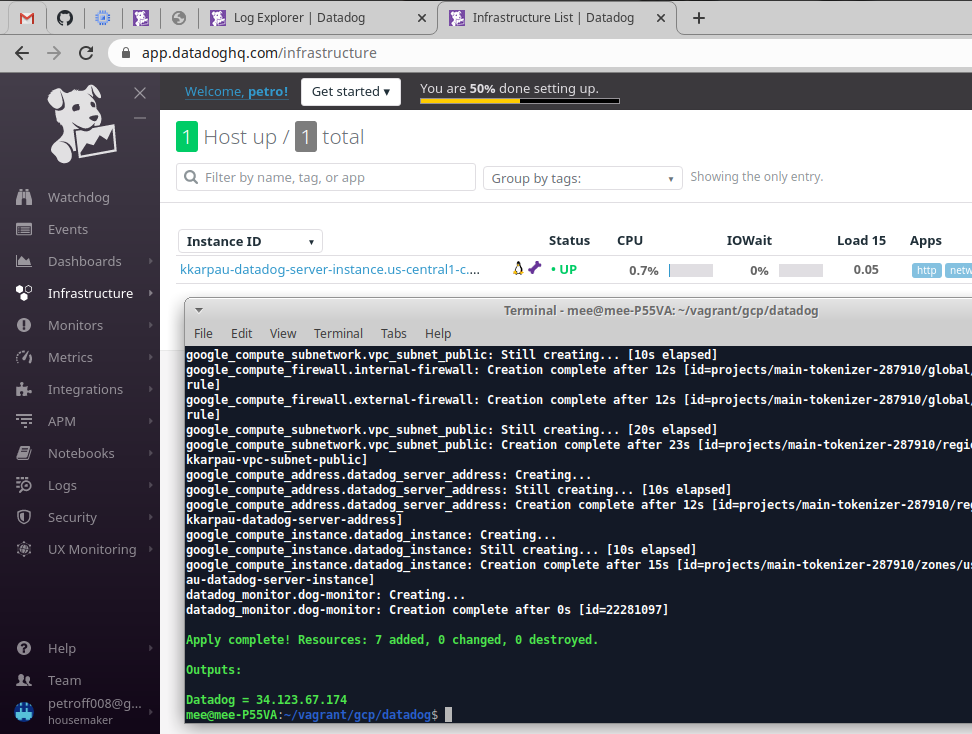
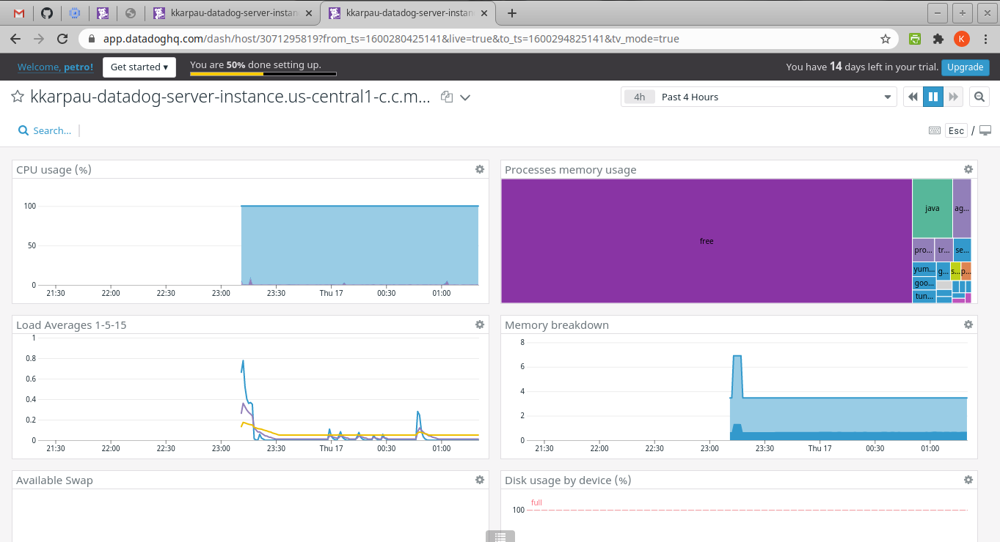
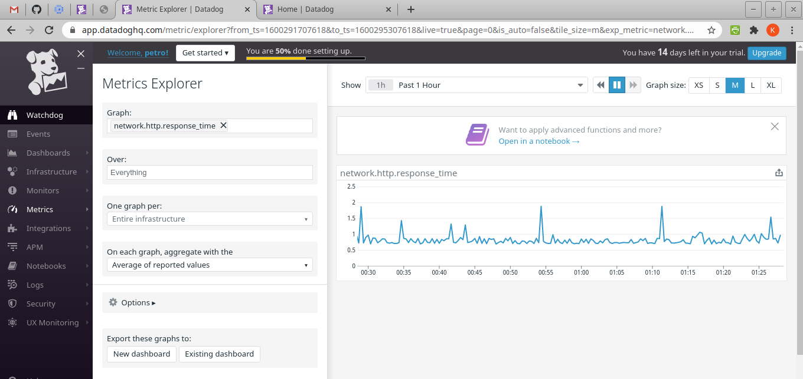
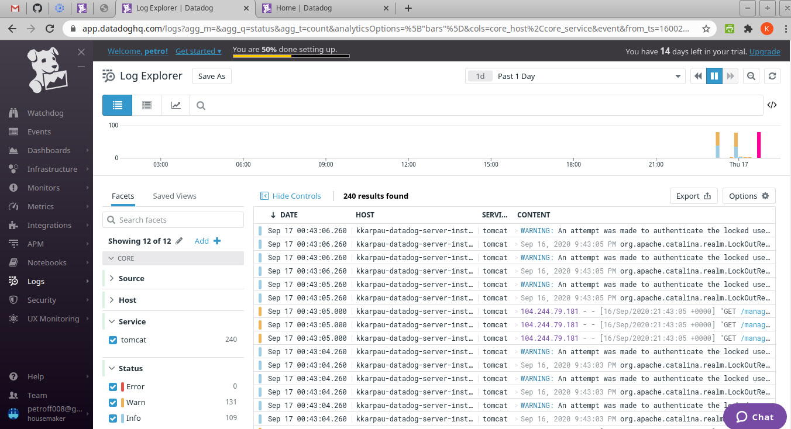
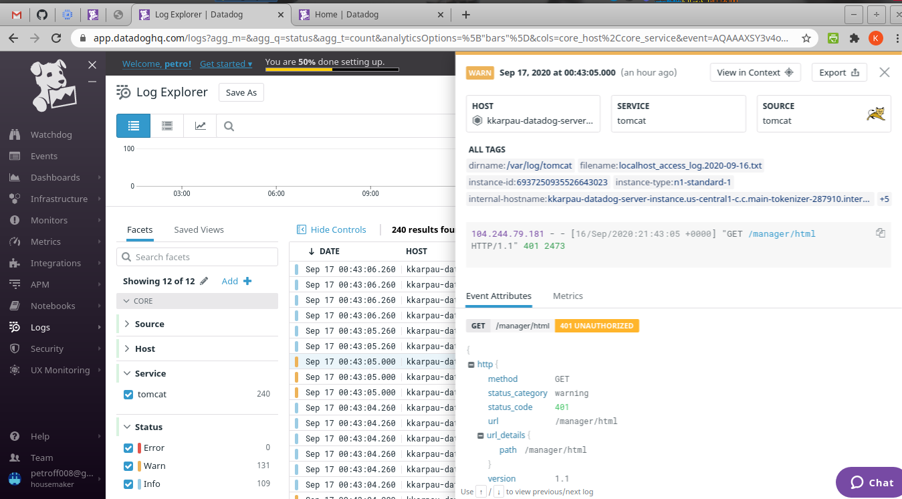
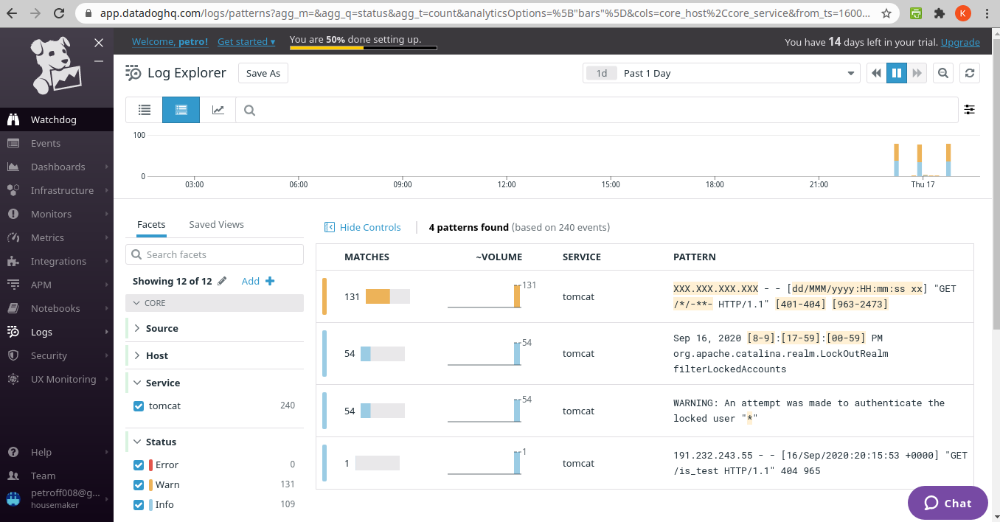
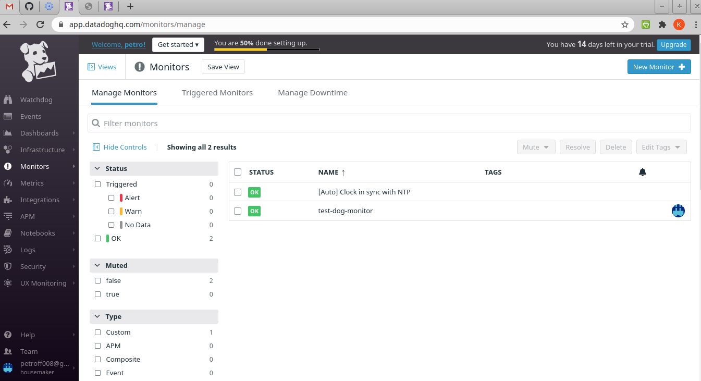
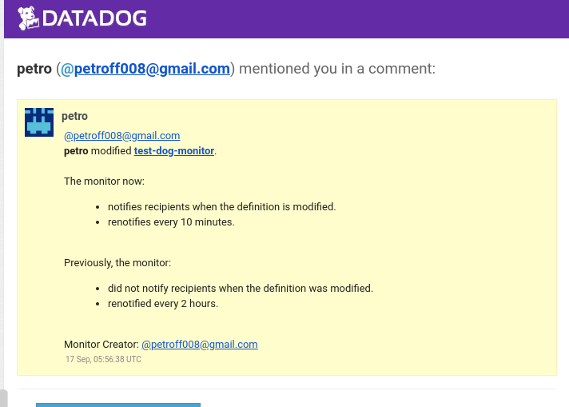

Datadog lab
============
1. Change `project` in `variables.tf`
2. Export the GCP environment variables (credentials):
    * export GOOGLE_CLOUD_KEYFILE_JSON=/path/file
3. Export the Datadog environment variables (credentials):
    * export DD_APP_KEY=app_key
    * export DD_API_KEY=api_key
4. Run `terraform apply -var api_key=$DD_API_KEY` (or `terraform apply` api_key will be requested).

## Terraform just created Datadob infrastructure

## Metric explorer : network.http.responce_time

## Log explorer, list view

## Log explorer, detailed view

## Log explorer, pattern view

## Monitoring

## Test email notification
