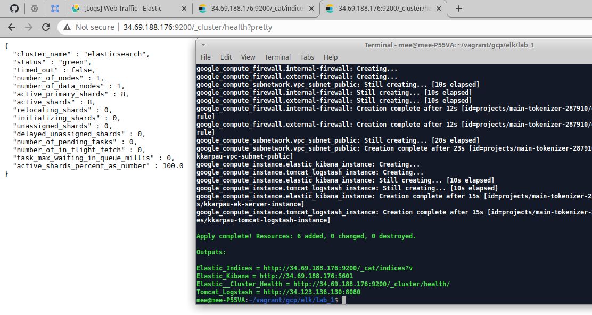
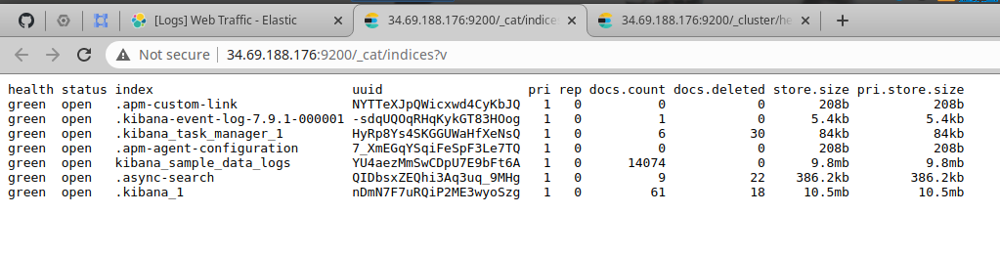
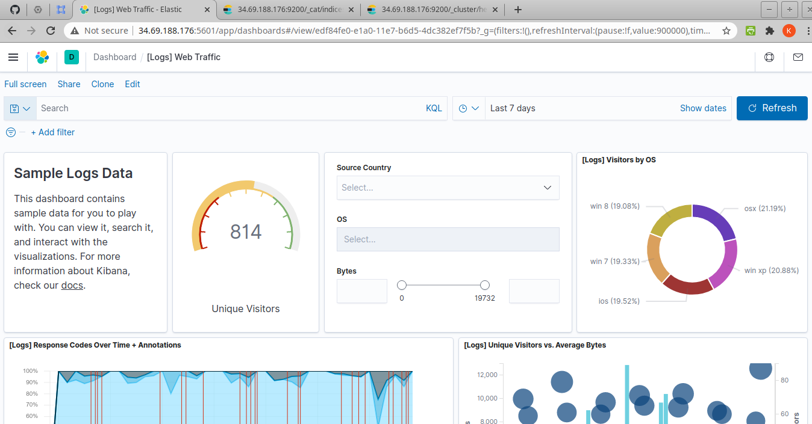
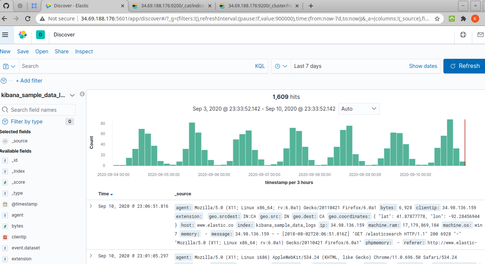

# ELD lab_1
Change `project` in `variables.tf`

Screenshot:

Create infostructure via Terraform & Elasticsearch HealthCheck 

Elastic_Indices

Kibana Sample Logs data

Kibana Discover (Sample_Logs_data)

