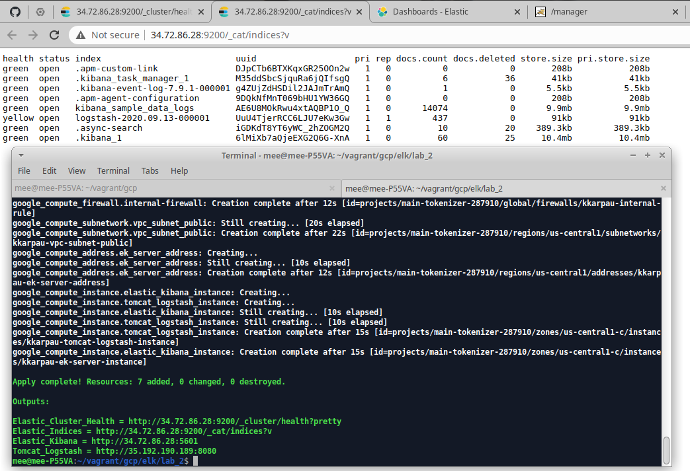
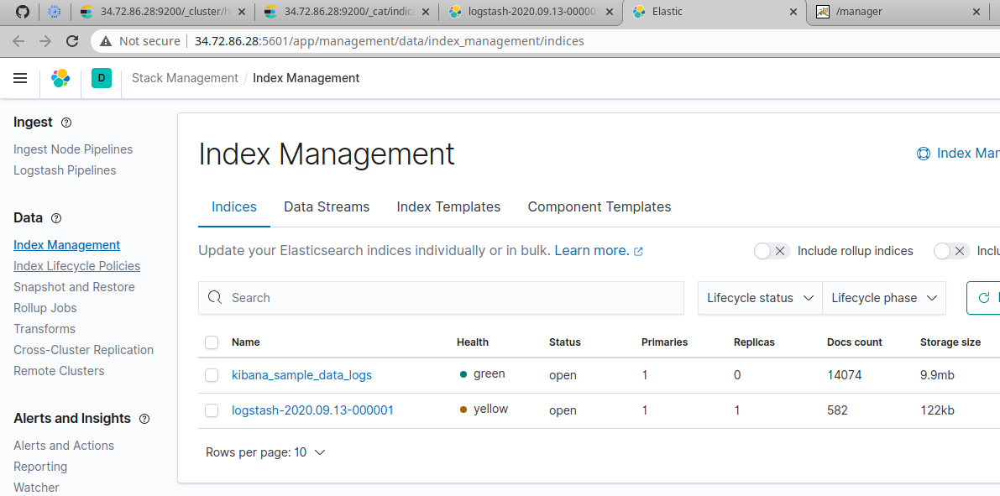
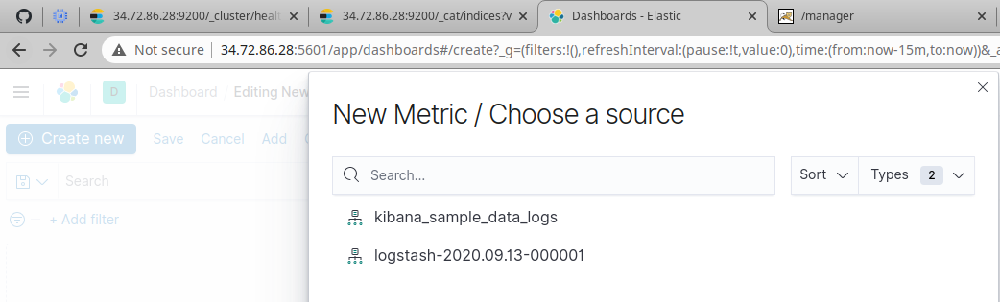
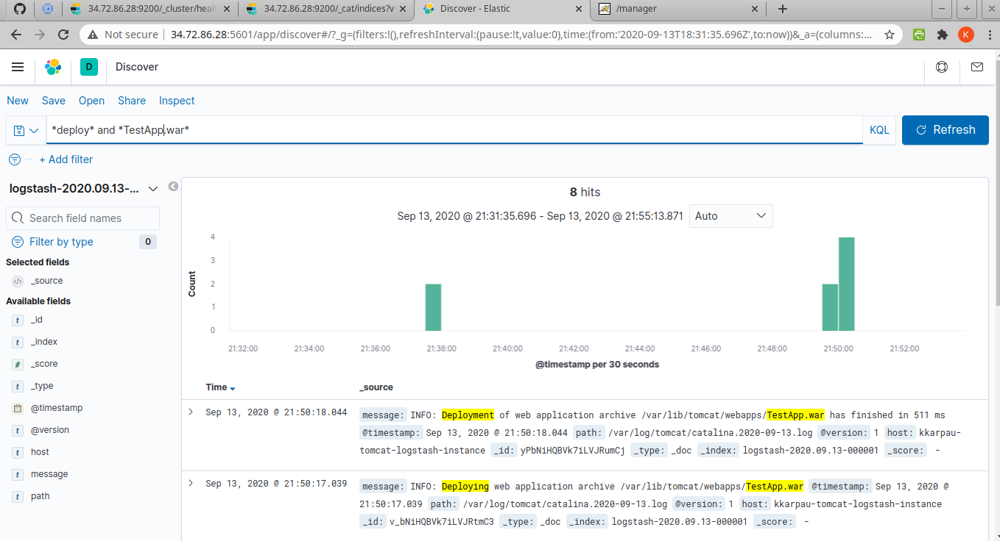
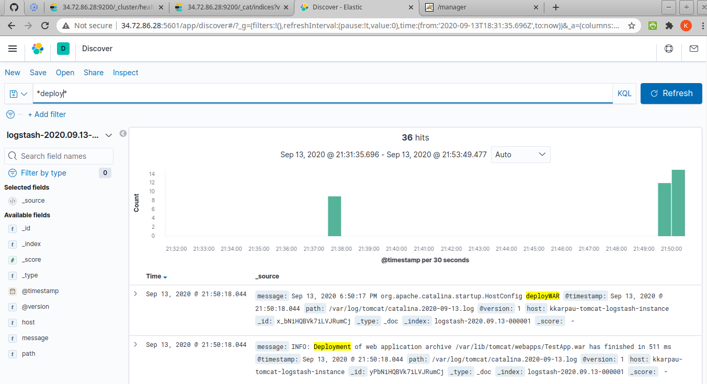
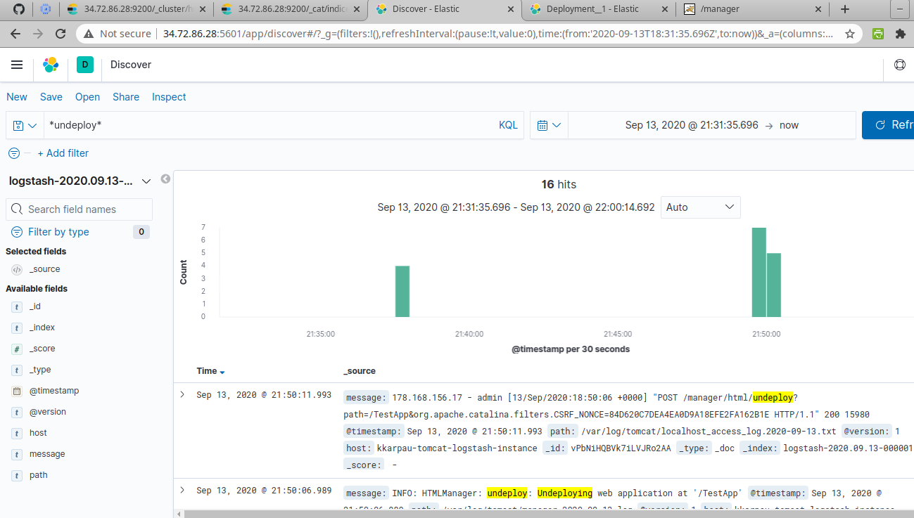
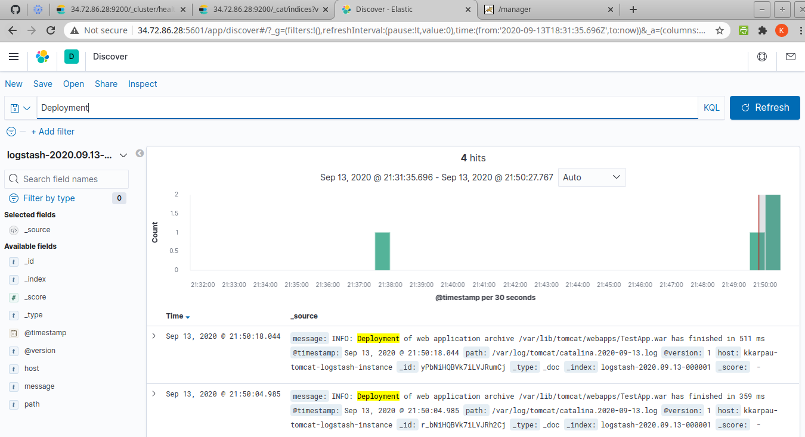
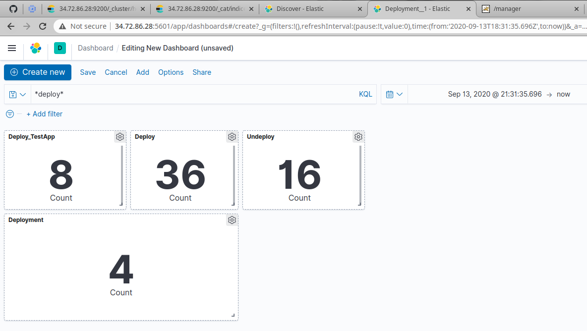

ELK lab_2
=========
Change `project` in `variables.tf`

## Create infostructure via Terraform & Elasticsearch Indices

## Index Management

## Create New Metric

## Checking several filters

## Dashboard with filters
