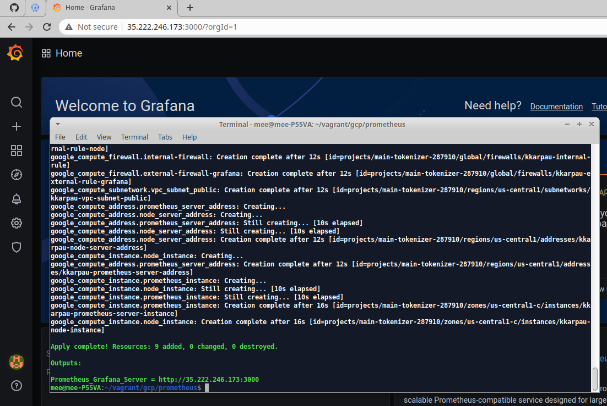
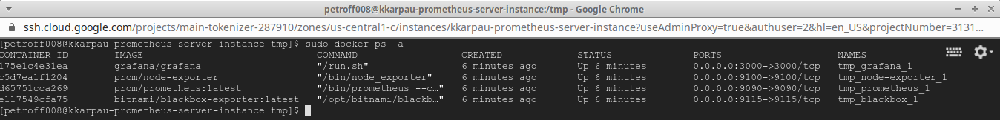
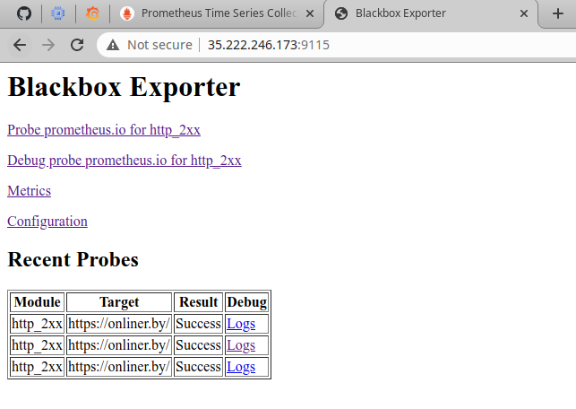
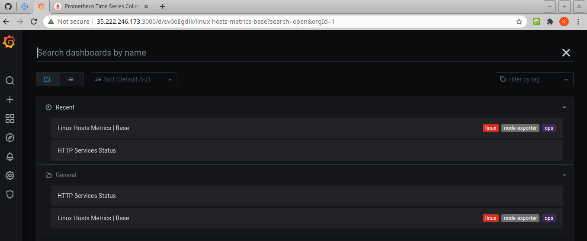
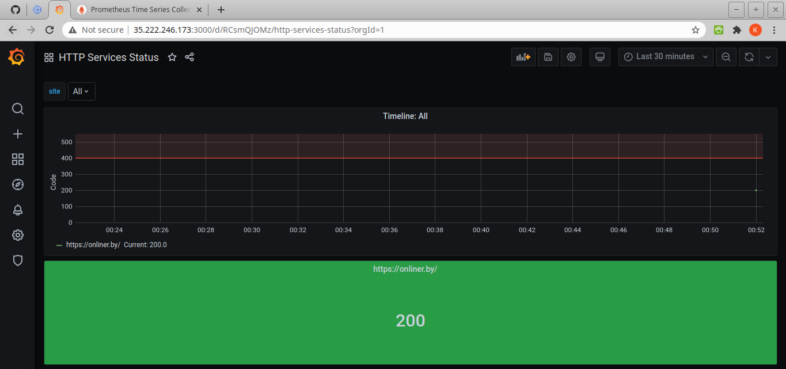
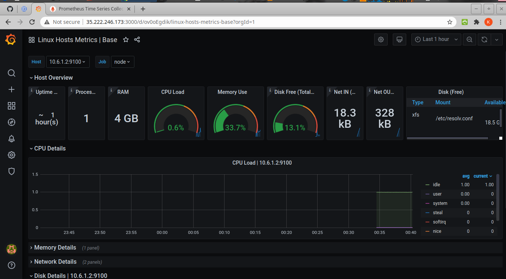
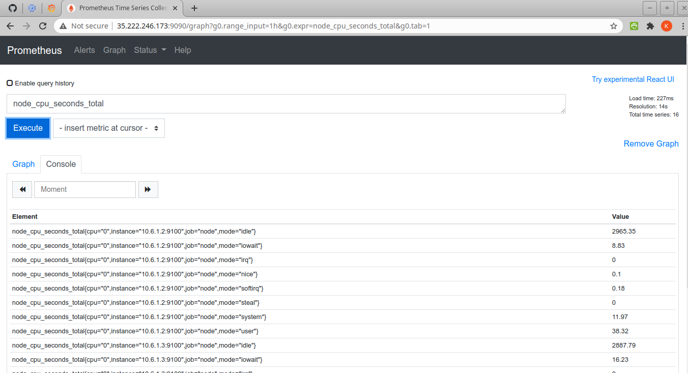
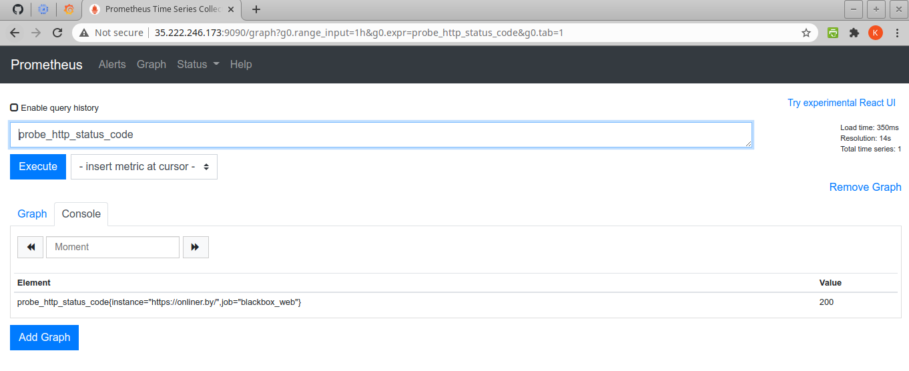

Prometheus/Graphana lab_1
=========================
Change `project` in `variables.tf`

## Created resources via Terraform

## Docker containers are running on instance server

## Blackbox exporter

## Metric just imported

## Http Metric with http_status_code

## Linux Metric with system configuration

## Prometheus metric query

