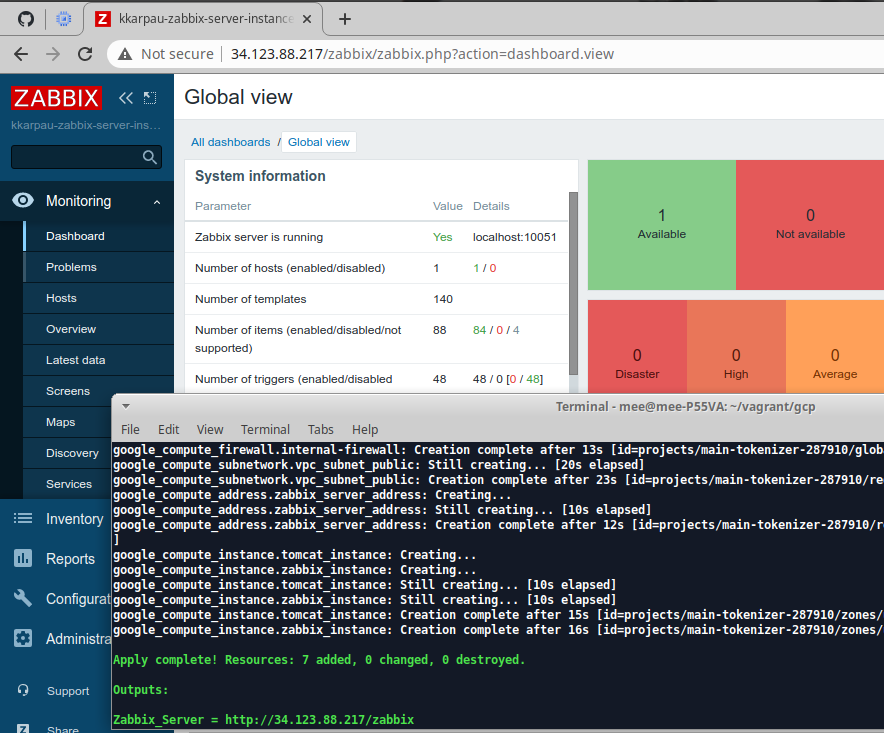
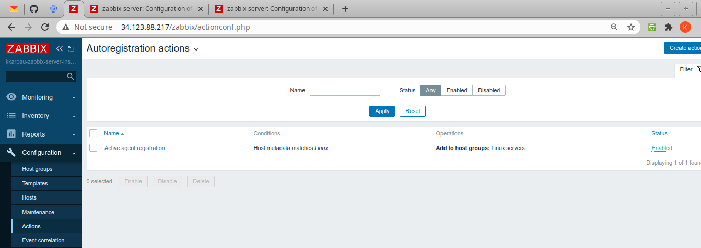
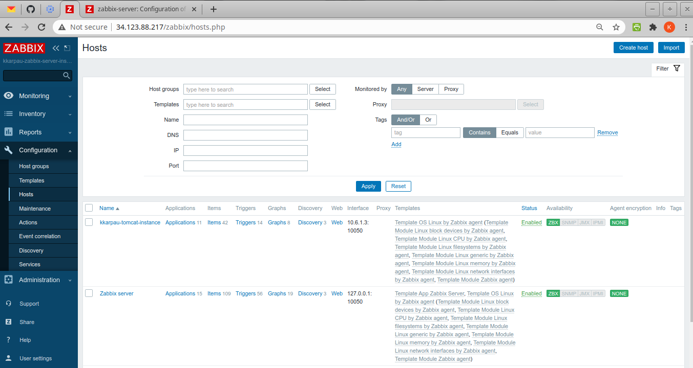
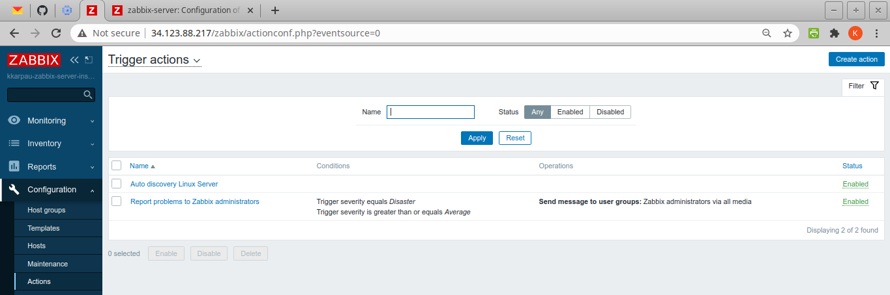
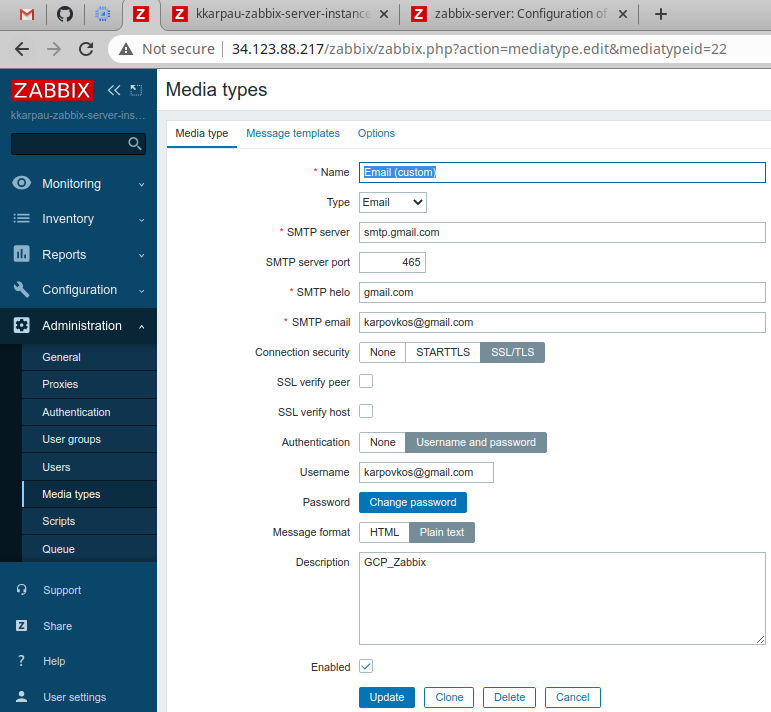
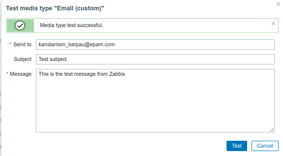
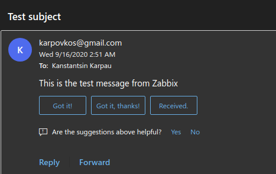
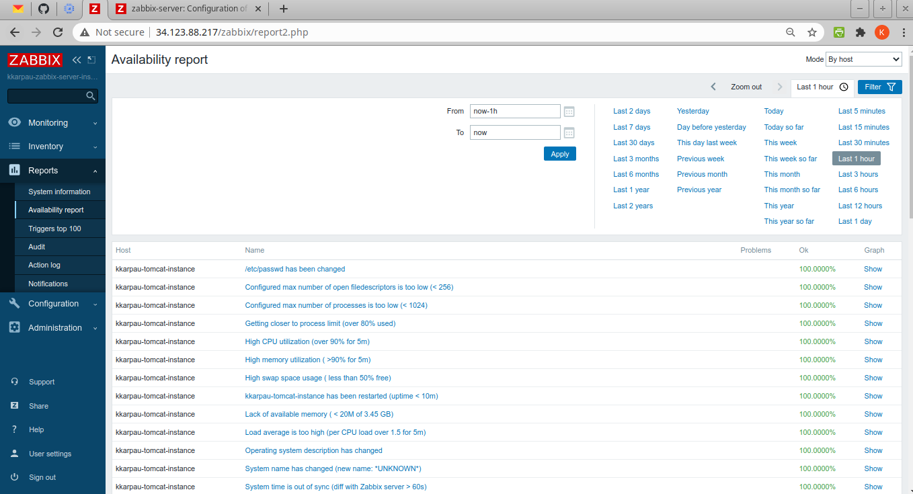
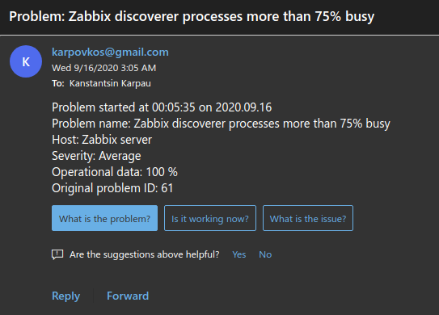

Zabbix lab_1
============
Change `project` in `variables.tf`

## Terraform just created Zabbix infrastructure, Global view

## Autoregistration actions

## Automatic added client host 

## Trigger actions

## Email configuration 

## Sending the test mail, just for test email credentials

## Receiving the test mail

## Available reports for admin

## Receiving problem-report from Zabbix
