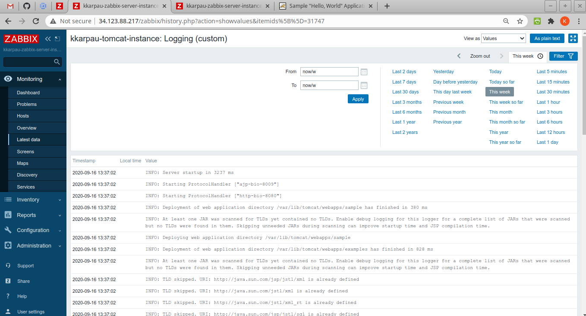

Zabbix lab_2
============
Change `project` in `variables.tf`

## Created instances via Terraform

## Web instance with Tomcat, Sample app as a web page is displayed

## Creating Web scenario for monitoring web application

## Details (5min) of web scenario: tomcat inscance

## Details (1 hour) of web scenario: tomcat inscance

## Creating log monitoring

## Log details 

